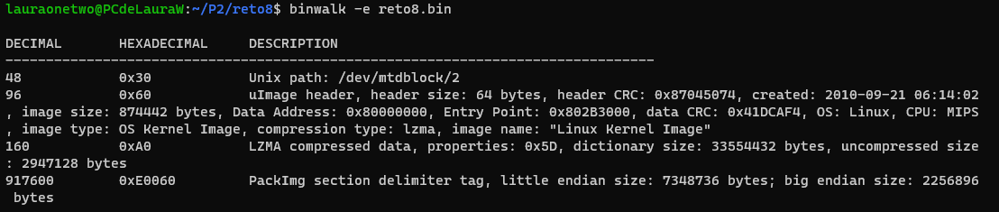
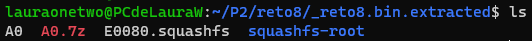
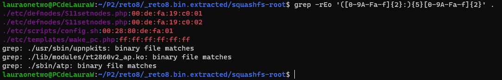
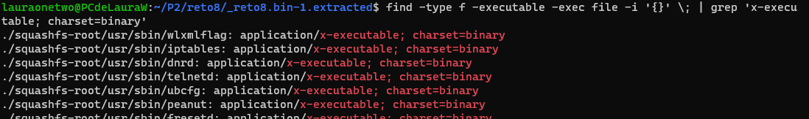
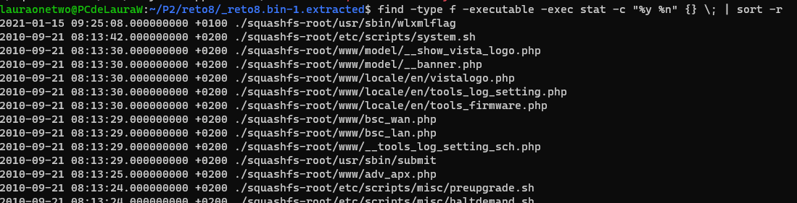
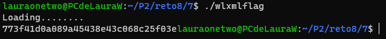

# Práctica 2: RETO 8
> Este reto está dividido en 7 subretos
+ <b>Categoría</b>: Forense
+ <b>Dificultad</b>: Media
+ <b>Puntuación total</b>: 315pts (7x45pts)
+ <b>Recursos</b>: [reto8.bin](resources/reto8.bin)

## Contexto general

Debemos investigar en el archivo binario para responder a las preguntas que nos hacen.

## Subreto 1
```
Tu amigo recibió un enlace sospechoso en las redes sociales sobre una posible vulnerabilidad de seguridad en su router doméstico. La página enlazada sugería una actualización de software. Investiga el paquete y encuentra respuestas a las siguientes preguntas.

¿Cuál es la cabecera CRC del archivo firmware?

> Formato: cabecera
```

## Ejecución 1

1. Instalamos [binwalk](https://github.com/ReFirmLabs/binwalk).

    ```
    sudo apt install binwalk
    ```
2. Navegamos hasta la ubicación de nuestro archivo binario y realizamos:

    ```
    binwalk -e reto8.bin
    ```

    Se nos exporta una carpeta con contenido y también nos dan una descripción:
    <br><br>
    

    Por tanto, la cabecera CRC que nos pedían es: ```0x87045074```.

## Subreto 2
```
¿Qué tipo de archivos de sistema hay en el firmware?

> Formato: nombre
```

## Ejecución 2

Tras la exportación que hicimos anteriormente, encontramos un archivo llamado ```E0080.squashfs```:
<br><br>

<br><br>
Entonces, la _flag_ es ```squashfs```.

## Subreto 3
```
¿Cuál es la dirección MAC FALLBACK de la interfaz WAN?

> Formato: dirección
```

## Ejecución 3

1. Buscamos recursivamente en todos los archivos de la exportación con el formato ```XX:XX:XX:XX:XX:XX```

    ```
    grep -rEo '([0-9A-Fa-f]{2}:){5}[0-9A-Fa-f]{2}'
    ```

2. Encontramos una serie de archivos con el formato:
<br><br>

<br><br>
La _flag_ es el que contiene el archivo ```./etc/scripts/config.sh```: ```00:28:80:de:fa:01```

## Subreto 4
```
¿Cuál es la primera IP de la configuración por defecto en DHCP?

> Formato: IP
```

## Ejecución 4

1. Realizamos una búsqueda parecida para encontrar IPs con el formato IPv4 y exportamos el resultado en un _.txt_ 
```
grep -rEo '([0-9]{1,3}\.){3}[0-9]{1,3}' > ips.txt
```

> He [aquí](resources/4/ips.txt) el resultado tras la búsqueda

2. Ahora el problema reside en cuál de las IPs corresponde al que nos piden.<br><br>
Sin ser la mejor opción, probamos con las distintas IPs una a una, pero primero realizamos una lista de IPs sin repeticiones obteniendo así: 
    ```
    ['60.1.5.0.0', '204.194.234.200', '10.112.112.113', '192.168.1.1', '1.112.112.133', '10.0.0.138', '1.11.0.0.0.0', '3.255.255.255.255', '192.168.10.1', '239.0.0.0', '192.168.0.199', '3.10.112.112.112', '255.0.0.0', '192.168.0.222', '192.168.0.50', '60.4.2.3.2', '3.10.112.112.114', '224.0.0.1', '192.168.0.1', '255.255.255.255', '255.255.0.0', '255.255.255.0', '204.194.232.200', '192.167.0.222', '192.168.10.222', '255.255.255.0', '239.255.255.250', '192.168.1.5', '192.168.0.1', '3.10.112.112.113', '10.112.112.114', '10.112.112.112', '2.0.0.0.0', '0.0.0.0', '10.0.0.2', '192.168.0.100', '192.167.0.1', '127.0.0.1', '10.0.0.212']
    ```
> He [aquí](resources/4/lista.py) el script utilizado para extraer una lista de IPs sin repeticiones.

3. La IP correcta para la _flag_ es: ```192.168.0.100```

## Subreto 5
```
¿Cuántos binarios ejecutables hay en el firmware?

> Formato: número
```

## Ejecución 5

1. Realizamos una búsqueda de binarios ejecutables:
<br><br>
    ```
    find -type f -executable -exec file -i '{}' \; | grep 'x-executable; charset=binary'
    ```
    

2. Contamos el número de resultados y es: ```41```

## Subreto 6
```
¿Qué binario ejecutable ha sido modificado en el firmware o añadido a este?

> Formato: `/fullpath/`
```

## Ejecución 6

1. Realizamos una búsqueda ordenada por fecha y hora de modificación con las rutas:
<br><br>

<br><br>
Vemos que hay un archivo creado/modificado en ```2021-01-15``` mientras que los demás archivos fueron creados en ```2010``` por lo que podemos intuir que el archivo ```wlxmlflag``` es el que buscamos.
<br><br>
Por tanto, la _flag_ es: ```/usr/sbin/wlxmlflag```

## Subreto 7
```
¿Cual es la flag que se muestra a través del binario modificado?

> Formato: flag
```

## Ejecución 7

1. Ejecutamos ```.\wlxmlflag```
<br><br>

<br><br>
La _flag_ es: ```773f41d0a089a45438e43c068c25f03e```
