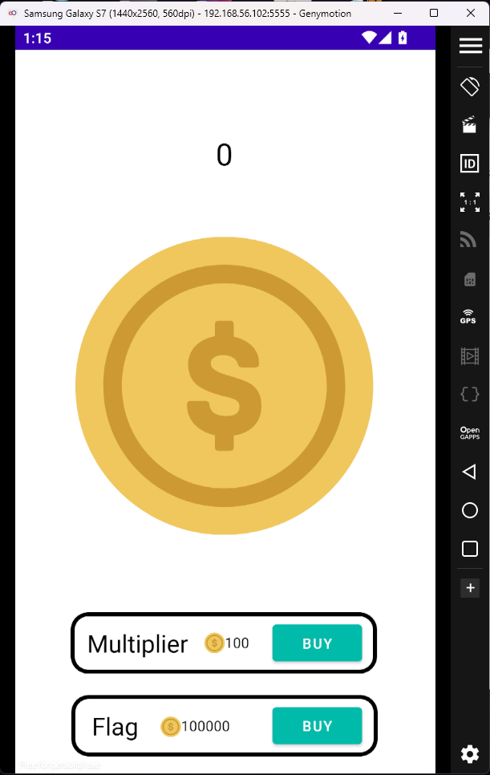
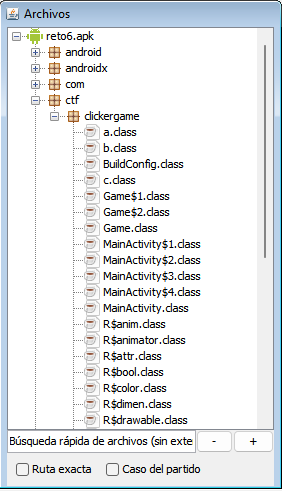
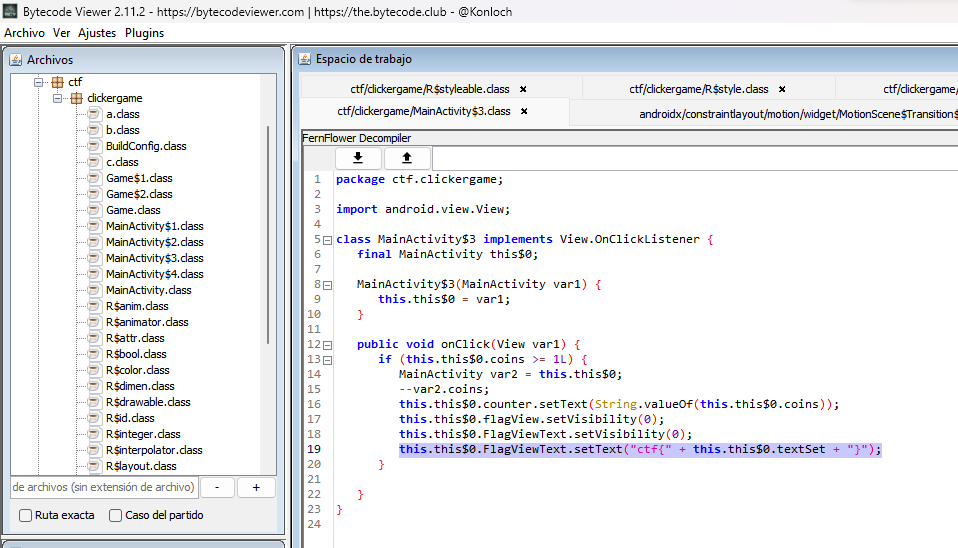
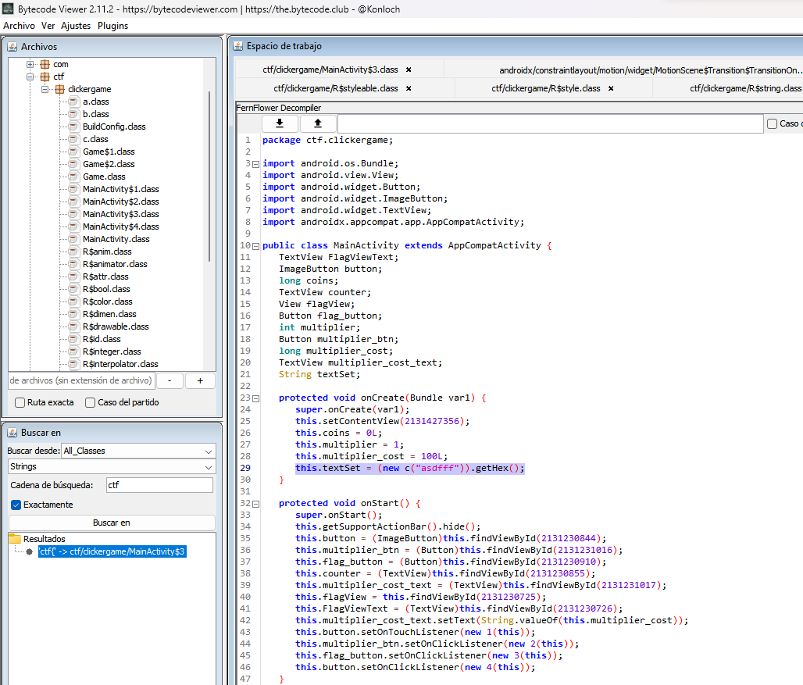
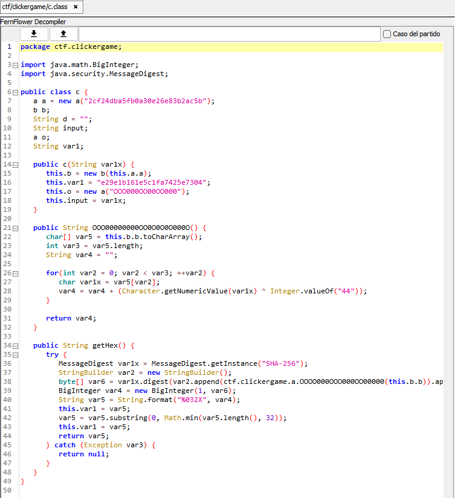

# Práctica 2: RETO 6

+ <b>Categoría</b>: Ingeniería Inversa
+ <b>Dificultad</b>: Media
+ <b>Puntuación</b>: 450pts
+ <b>Recursos</b>: [reto6.apk](resources/reto6.apk)

## Enunciado
```
Quieres conseguir el premio máximo de este juego. Lamentablemente, el premio máximo es tan caro que tienes que tomar métodos alternativos para ganarlo. Has conseguido hacerte con el archivo APK.

> Formato: ctf{...}
```

## Contexto

Nos dan una aplicación y vemos lo siguiente:



<br>

Se trata de un _clicker game_ que consiste en pulsar el botón de la moneda central para aumentar el contador.

El objetivo es conseguir la _flag_ que se puede comprar por 100.000 monedas.

## Ejecución

La idea es no malgastar el tiempo en hacer _click_ todas esas veces aun usando multiplicadores para conseguir la _flag_.

Es por ello que investigaremos la aplicación por dentro:

1. Descargamos [Bytecode Viewer](https://bytecodeviewer.com/).
2. Abrimos la aplicación desde el .jar descargado.
3.  ```reto6.apk > ctf > clickergame``` <br><br>

<br><br>
4. Buscamos el string ```ctf``` y lo encontramos en el archivo ```MainActivity$3```.
<br><br>

<br><br>
Luego, debemos averiguar qué es ```this.this$0.textSet```.

5. ```this.this$0``` es una instancia de la clase exterior ```MainActivity``` y, por tanto, ```this.this$0.textSet``` es una variable de esa clase.
<br><br>

<br><br>
Este valor contiene una _string_ creado a partir de una instancia de ```c.class``` y llamando al método _getHex()_: 
<br><br>

<br><br>
Nos damos cuenta que ```c.class``` hace uso de ```a.class``` y ```b.class```.

6. Para calcular el valor de ```this.this$0.textSet```, exportamos el código _java_ de ```a.class```, ```b.class``` y ```c.class```, y creando un código auxiliar para simplemente imprimir el valor en consola:
    ```java
    public class Main {
        public static void main(String[] args) {
            String textSet = (new c("asdfff")).getHex();
            System.out.println(textSet);
        }
    }
    ```
> Descarga [aquí](resources/java.zip) el código completo para ejecutar.

7. El valor de ```this.this$0.textSet``` es ```6A58CDCFCFE5C3AA41E01A5908BD9F8D```, por lo que la _flag_ es ```ctf{6A58CDCFCFE5C3AA41E01A5908BD9F8D}```.
